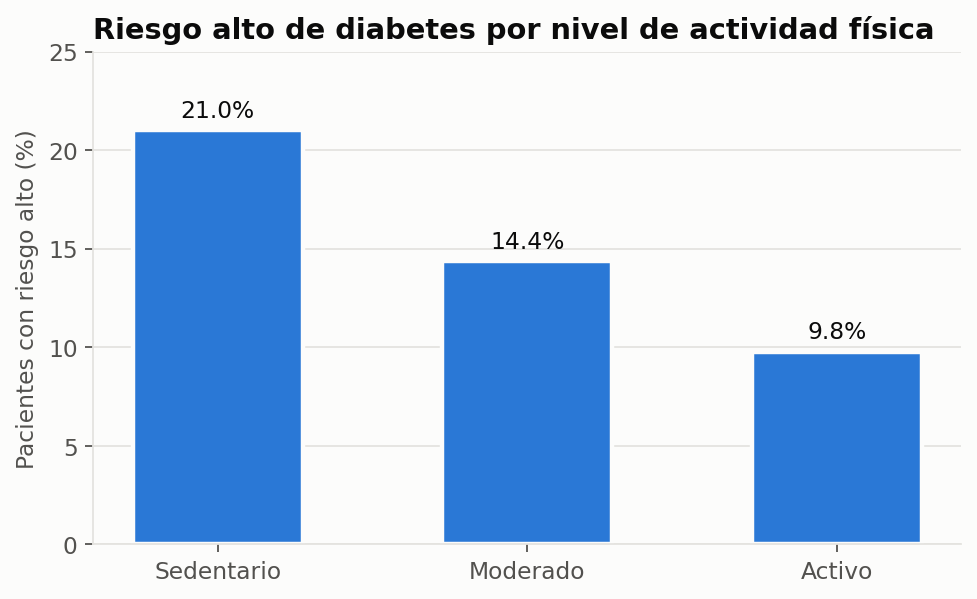
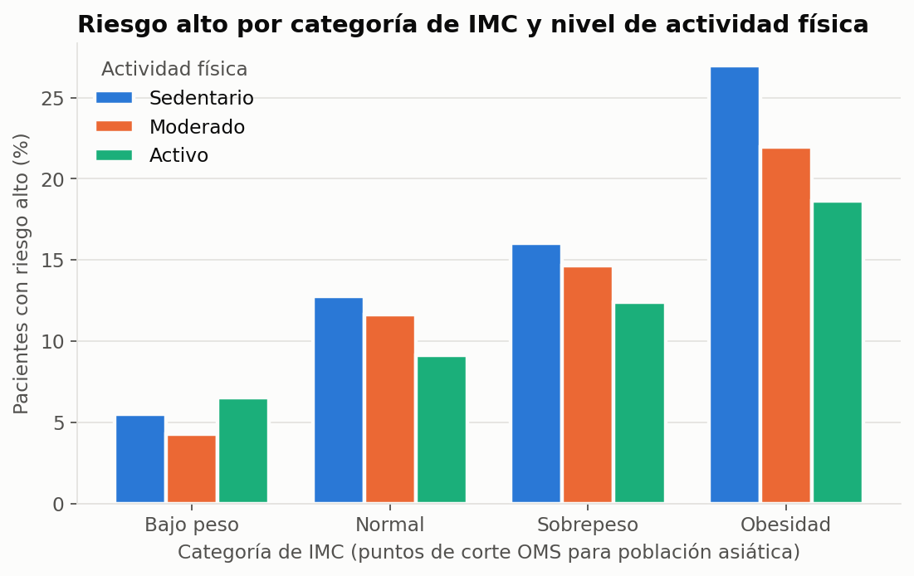
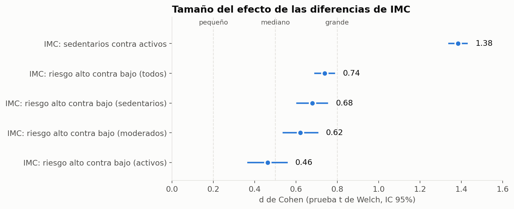
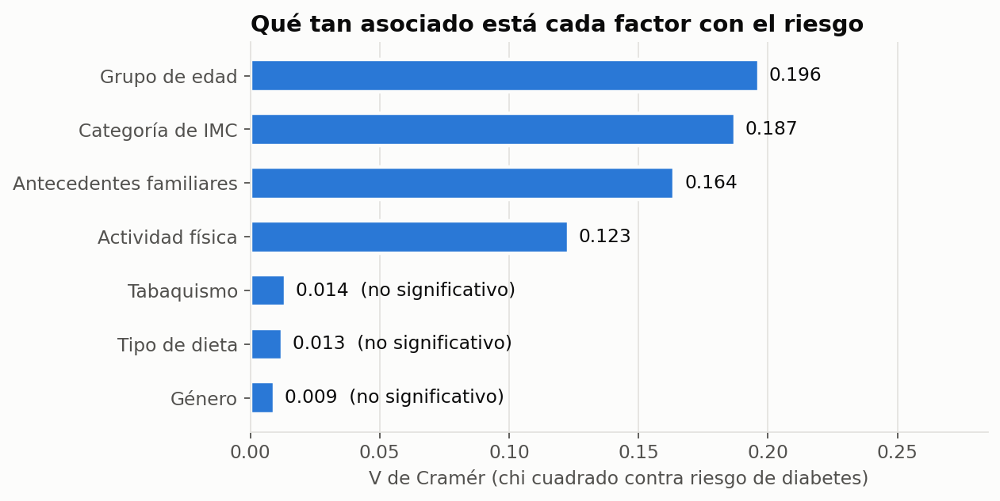

# ¿Existe una asociación significativa entre el nivel de actividad física y el IMC como predictores del riesgo de diabetes?

## Desafío
Con datos de 15,000 pacientes en India, no se sabía si el nivel de actividad física y el índice de masa corporal (IMC) realmente están asociados con el riesgo de diabetes, o si otros factores como la edad, los antecedentes familiares, el género, la dieta o el tabaquismo lo explicaban mejor.

## Proceso
Limpié y exploré el dataset, investigando el origen de los valores nulos. Después clasifiqué a los pacientes por categoría de IMC (con los puntos de corte de la OMS para población asiática) y por grupo de edad, y puse a prueba mis hipótesis con chi cuadrado, ANOVA de Welch y pruebas t de Welch, cruzando IMC y actividad física en ambos sentidos.

## Resultado
El riesgo alto de diabetes baja de 21.0% en pacientes sedentarios a 9.8% en pacientes activos, y los pacientes de riesgo alto tienen en promedio 2.98 puntos más de IMC que los de riesgo bajo. Sin embargo, actividad física e IMC están muy relacionados entre sí: los sedentarios tienen 4.87 puntos más de IMC que los activos. Esto sugiere que la mejor estrategia de prevención es combinar actividad física y control de peso, priorizando el tamizaje en mayores de 45 años y en personas con antecedentes familiares.


# Diabetes Risk Analysis on Indian Population

## Resumen

Análisis estadístico e inferencial de un dataset de 15,000 pacientes de 18 ciudades de India, con 19 columnas. El objetivo fue responder si el nivel de actividad física y el IMC están asociados con el riesgo de diabetes (`diabetes_risk`: Low, Moderate, High), y revisar qué otros factores se relacionan con ese riesgo. Trabajé en fases: calidad de datos, limpieza, estadística descriptiva, pruebas de hipótesis y un cierre con insights y recomendaciones.

## Principales hallazgos

### 1. A mayor actividad física, menor riesgo alto de diabetes



- El porcentaje de pacientes con riesgo alto baja de 21.0% en sedentarios a 14.4% en actividad moderada y 9.8% en activos.
- La asociación es significativa (chi cuadrado = 453.49, p = 7.65e-97), pero su tamaño de efecto es pequeño (V de Cramér = 0.123). Con 15,000 pacientes, incluso diferencias modestas resultan significativas.

### 2. El IMC pesa más que la actividad física, y ambos van de la mano



| Categoría de IMC | Sedentario | Moderado | Activo |
|---|---|---|---|
| Bajo peso | 5.5% | 4.3% | 6.5% |
| Normal | 12.8% | 11.7% | 9.1% |
| Sobrepeso | 16.0% | 14.6% | 12.4% |
| Obesidad | 27.0% | 22.0% | 18.6% |

- Dentro de cada nivel de actividad física, el riesgo alto sube conforme sube la categoría de IMC. La combinación más riesgosa es obesidad con sedentarismo (27.0%).
- Al revés, dentro de cada categoría de IMC, la actividad física sigue asociada al riesgo, pero mucho más débil (V de Cramér entre 0.04 y 0.06, contra 0.123 sin controlar por IMC). En Bajo peso y Sobrepeso el p valor queda muy cerca de 0.05, así que esos resultados son frágiles.
- Esto nos dice que buena parte de la relación entre actividad física y riesgo pasa por el IMC.

### 3. Tamaño del efecto: las diferencias de IMC son reales y medibles



- **Sedentarios contra activos:** 4.87 puntos más de IMC (IC 95% de 4.73 a 5.01), d de Cohen = 1.38, efecto grande. Es la diferencia más marcada de todo el análisis.
- **Riesgo alto contra riesgo bajo:** 2.98 puntos más de IMC (IC 95% de 2.78 a 3.17), d de Cohen = 0.74, efecto mediano.
- La diferencia de IMC entre riesgo alto y bajo se va haciendo más chica conforme aumenta la actividad física (d de 0.68 en sedentarios a 0.46 en activos). Es un indicio de que la actividad física podría atenuar la relación entre IMC y riesgo, aunque no es una prueba formal de interacción.

### 4. Edad y antecedentes familiares también cuentan; género, dieta y tabaquismo no



- La edad es el factor con la asociación más fuerte: el riesgo alto sube de 4.1% en menores de 30 años a 32.4% en el grupo de 60 años o más.
- Los pacientes con antecedentes familiares de diabetes tienen 19.7% de riesgo alto, contra 12.5% sin antecedentes.
- Género, tipo de dieta y tabaquismo no mostraron asociación con el riesgo (p mayor a 0.25 y V de Cramér cercana a 0).

## Contenido del repositorio

- `notebooks/notebook.ipynb`: notebook principal con todo el análisis.
- `data/raw/diabetes_risk.csv`: dataset original, tal como se descarga de Kaggle.
- `data/clean/diabetes_risk_clean.csv`: dataset limpio, generado en el Paso 3 del notebook.
- `figures/`: gráficas de este README.
- `py/libraries.py`: script que descarga el dataset desde Kaggle con `kagglehub` y lo copia a `data/raw`.
- `py/generar_figuras.py`: script que genera las gráficas de `figures/` a partir del dataset limpio.
- `requirements.txt`: dependencias necesarias para ejecutar el análisis.
- `LICENSE`: licencia del proyecto (MIT).

## Resumen de trabajo realizado

- **Paso 1, Carga de datos:** se cargó el dataset (15,000 filas, 19 columnas) y se revisaron tipos de datos y estructura general.
- **Paso 2, Calidad de datos:**
	- Sin filas duplicadas, sin `patient_id` repetidos y sin sentinels.
	- Nulos en `alcohol_consumption` (3,788, 25.3%), `smoking_status` (472, 3.1%) e `income_bracket` (463, 3.1%).
	- Los nulos de `alcohol_consumption` dependen del género (MAR): 41.3% de las mujeres no tiene el dato, contra 10.3% de los hombres. Los otros dos se comportan como MCAR.
- **Paso 3, Limpieza básica:**
	- Los nulos se rellenaron con la categoría `'Sin dato'` en lugar de la moda, para no inflar la categoría más común.
	- Se convirtieron las variables ordinales a tipo `category` ordenado.
	- Se crearon `categoria_imc` (puntos de corte de la OMS para población asiática: 18.5, 23 y 25) y `grupo_edad`.
- **Paso 4, Estadística descriptiva:**
	- Resúmenes por nivel de riesgo, histogramas, boxplots y outliers con el método IQR. Los outliers se conservaron porque son valores clínicos posibles.
	- Matriz de correlación de Spearman: la glucosa en ayunas (0.73) y la HbA1c (0.72) son las variables más correlacionadas con el riesgo, seguidas de la edad (0.30) y el IMC (0.28).
- **Paso 5, Pruebas de hipótesis** (alfa = 0.05):
	- Chi cuadrado para variables categóricas, con V de Cramér.
	- ANOVA de Welch para comparar tres grupos, con eta cuadrada.
	- Una prueba t de Welch planeada entre los grupos extremos, con intervalo de confianza del 95% y d de Cohen. Se usó la versión de Welch porque las varianzas no son iguales entre grupos.
	- Validación de la variable objetivo: los pacientes de riesgo alto tienen en promedio 78.24 más de glucosa en ayunas y 1.71 más de HbA1c que los de riesgo bajo (d de Cohen cercana a 2.5), lo que confirma que la etiqueta de riesgo es coherente.
- **Paso 6, Insight ejecutivo:** síntesis de hallazgos, recomendaciones y limitaciones.

## Recomendaciones

- Promover la actividad física como estrategia de prevención, ya que el riesgo alto se reduce a menos de la mitad entre sedentarios y activos.
- Reforzar el control de peso usando los puntos de corte de IMC para población asiática, que son más sensibles para población de India.
- Diseñar campañas que combinen actividad física y control de peso, en lugar de tratarlos como iniciativas separadas.
- Priorizar el tamizaje de diabetes en mayores de 45 años y en personas con antecedentes familiares.

## Limitaciones

- Es un estudio observacional: los resultados muestran asociación, no causalidad.
- Hay indicios de que el dataset podría ser sintético: el riesgo tiene proporciones exactas (60% Low, 25% Moderate, 15% High) y la actividad física está casi perfectamente balanceada (34%, 33%, 33%). Por ello, las conclusiones no se pueden generalizar a la población real de India.
- Todas las pruebas evalúan un factor a la vez. Como siguiente paso, se sugiere un modelo de regresión logística ordinal para medir el aporte de cada factor controlando por los demás.

## Cómo reproducir el análisis

1. Requisitos mínimos
	- Python 3.11 o superior
	- Jupyter Notebook o Jupyter Lab

2. Instalar dependencias (ejecutar en terminal, desde la raíz del proyecto)

```powershell
python -m pip install -r requirements.txt
```

3. Descargar el dataset (opcional, ya está incluido en `data/raw`). El script usa rutas relativas, por lo que se ejecuta desde la carpeta `py/`

```powershell
cd py
python libraries.py
cd ..
```

4. Ejecutar el notebook

```powershell
jupyter notebook notebooks/notebook.ipynb
```

5. Regenerar las gráficas del README (opcional, requiere haber ejecutado el notebook para tener el dataset limpio)

```powershell
cd py
python generar_figuras.py
cd ..
```

## Fuente de datos

Dataset público de Kaggle: [yashlakra37/indian-diabetes-risk-csv](https://www.kaggle.com/datasets/yashlakra37/indian-diabetes-risk-csv).
